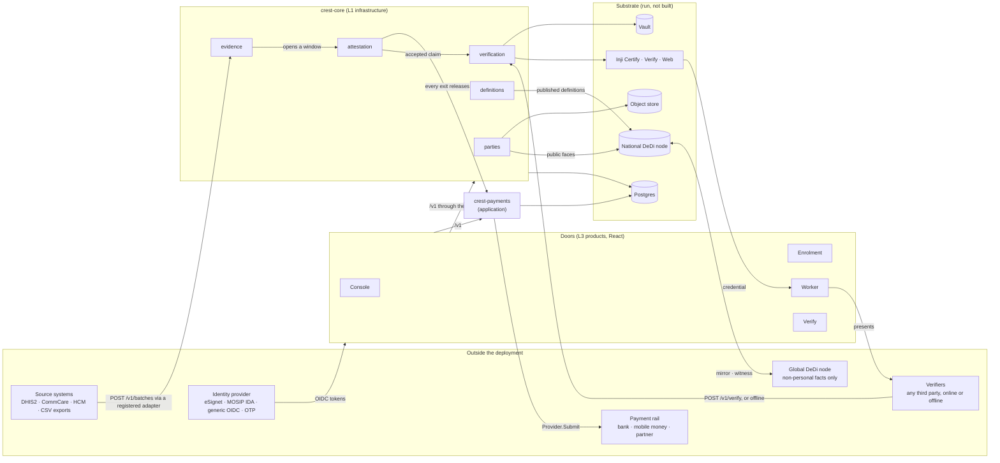

# High-level design

## Reading the diagram

- **Everything inside the deployment is sovereign and in-country.** The global DeDi node holds only non-personal facts and cannot be bypassed silently, because national and global nodes witness each other.
- **Two deployables.** `crest-core` is the infrastructure layer as one process with five API boundaries. `crest-payments` is the first application on it, deliberately outside the layer ([#127](https://github.com/theflywheel/CREST/issues/127)): nothing beneath it knows a confirmation window or a rail exists.
- **Three substrates carry the layer.** Inji is the credential lifecycle; DeDi is the directory substrate that gives every public registry tamper-evidence, inclusion proofs and witnessing; CREST's own services hold what neither knows about: work, evidence, strength, consent, and personal data. Nothing here invents cryptography, wallets or directory infrastructure.
- **The path that matters** runs evidence → claim → window → exit → credential and payment. It ends in the worker's hands: a credential they hold and money that releases on every exit.

## Where requests enter

Every door is a static site behind an nginx that proxies `/api/crest-<name>/…` to the services over private networking and refuses `/internal/*` at the door (the Blueprint §16 fence). The Go services carry no public domain. The older member names (`crest-registry`, `crest-definitions`, `crest-evidence`, `crest-verification`, `crest-confirmation`) alias onto the two deployables so links already in the wild keep resolving.

The blueprint's own rendering of this diagram, with the primitive graph and the information-flow figure beside it, is in [§1 of the blueprint](../crest-infrastructure-blueprint.html#s1).

