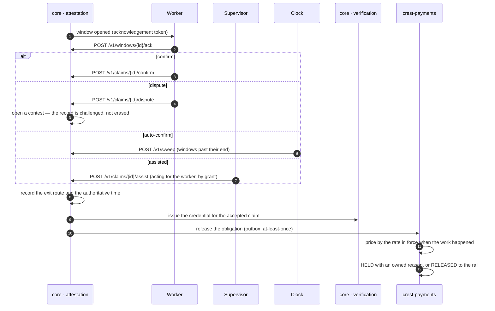

# The confirmation window and its four exits

**J7 · W-1, J8 · W-4.** A window opens on every claim and the worker is told. It closes one of four ways: the worker confirms, the worker disputes, the clock auto-confirms at the window's end, or a supervisor confirms for a worker who could not be reached. Every one of the four releases the payment obligation; a dispute contests the record, it never withholds the money. The window's length is programme policy, not infrastructure.

## What holds it

- All four exits are proven to release, the dispute hardest of all: `TestADisputeStillReleasesPayment`.
- A worker who was never reached is not auto-confirmed against; the unreached list is the supervisor's assisted route.
- The exit's time, not the receipt's, is what the credential signs.
- A release that reaches payments while the mechanism is not live is held as `mechanism_not_live`, owned by the mechanism owner, and released by activation at the rate in force.

## Recordings

- [The worker confirms her record](../assets/clean-slate-watch/J7-j7-worker-confirms-her-record.mp4) (39 s)
- [Assisted confirmation and the handoff](../assets/clean-slate-watch/J8-j8-assisted-confirmation-and-handoff.mp4) (17 s)

Screens: w1_7–w1_12, w4_2–w4_4. Next: [CREDENTIALS_AND_VERIFICATION.md](CREDENTIALS_AND_VERIFICATION.md).

