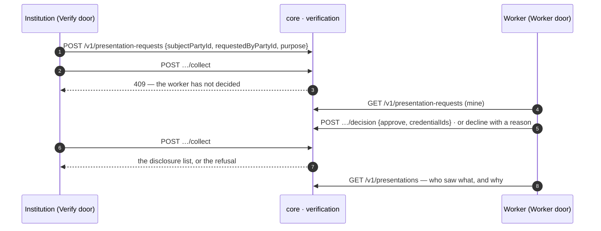

# Consent per share

**W-1, V-2.** The bare credential already proves the work is real. An onboarded institution that wants more than that asks; the ask names the asker and the purpose, the worker reads both and decides, and collecting before the decision is refused by the service. What was disclosed, to whom and why, is on the worker's own trail.

## What holds it

- A request without a named asker and a stated purpose is refused: consent to an unnamed asker for an unstated reason is not consent.
- A decline is a real state with the worker's reason on it; the institution sees the refusal, not silence.
- The presentation history is private to the worker; an anonymous read of it is refused.

Screens: w1_19, w1_20, v2_2. Next: [DUPLICATES_AND_RECOVERY.md](DUPLICATES_AND_RECOVERY.md).
