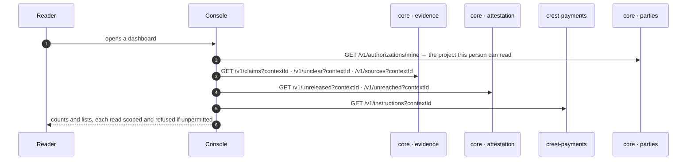

# Reading it all back

**J9 · P-2, J11 · G-4, J10 · V-4.** The project's dashboards, the custodian's registry views and the funder's portfolio are live reads over the records the earlier flows wrote, scoped to a project and answered only to a caller with a grant there.

| Reader | Screens | What is live | What is deliberately absent |
|---|---|---|---|
| Project configurator | Work status, straight-through, quality, payments, proof, reports, receipt | Claims, unclear rows, windows, instructions grouped by held reason with owners, source assessments, a batch's receipt | Any figure with no store behind it says so on its face |
| Registry custodian | Coverage, quality worklist, duplicates, reuse, unclear rows, recoveries | Counts by the deployment's own place vocabulary; the reuse rate with its derivation on screen; holds and their metric | A fabricated zero: an empty registry reports the null state |
| Funding viewer | Portfolio, drill | Delivered units by place and definition, money paid, in flight and stuck | Any worker's name: nothing on the screen names one, and nothing needs to |

## Recordings

- The project dashboards (recording `J9-j9-project-dashboards.mp4`) (34 s)
- The registry dashboards (recording `J11-j11-registry-dashboards.mp4`) (31 s)

Not recorded: the funding viewer, because no record derives that persona on a clean deployment.

Screens: p2_11–p2_16, g4_4–g4_7, v4_1–v4_2. Back to the [index](README.md).
