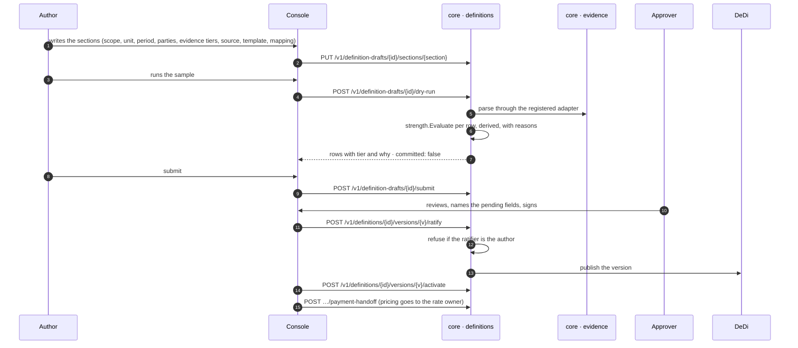

# A definition is written, proven dry, and ratified

**J4 · P-3.** The author writes what counts as a unit of work section by section, runs the draft against a real sample through the real adapter and strength function without writing anything, and submits. A different party ratifies, naming what is still pending. The tier is derived on the dry run, never typed.

## What holds it

- The tier map names which provenance reaches which tier under reference numbering (1 strongest); the source screen derives the ceiling a provenance can reach and says it is not stored.
- The dry run writes no unit, no source, no queue entry; it shows the same rows twice under different provenance to prove the tier is derived.
- A draft is mutable only while open; submission is one transaction; ratification records the event log with both actors named.

## Recordings

- [The author writes and submits](../assets/clean-slate-watch/J4-p3-author-writes-and-submits-the-definition-8x.mp4) (14 s at 8×)
- [The approver ratifies with the gaps named](../assets/clean-slate-watch/J4-p3-approver-ratifies-with-the-gaps-named.mp4) (22 s)

Screens: p3_1–p3_28. Next: [PAYMENT_SETUP.md](PAYMENT_SETUP.md).
