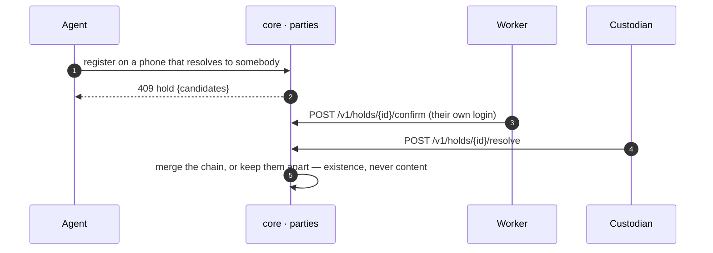
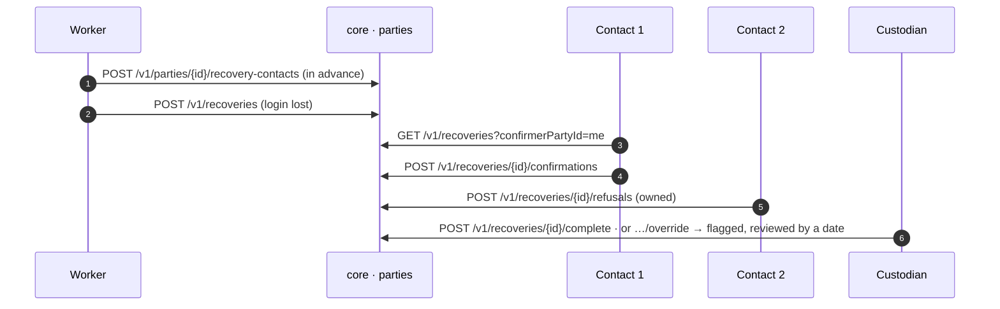

# Duplicates hold, and recovery of a lost login

## Duplicates hold, and never merge by themselves

**G-4.** A second registration on an identifier that already resolves does not merge: the service answers 409 with a hold. The worker confirms it is them from their own login, and only then does the custodian decide. A merge without both is a monitored metric that must read zero.

A verifier resolving the survivor sees the whole chain's credentials and never a word about a merge: the residue is stated in the blueprint's §16 rather than hidden.

## Recovery of a lost login

**W-1, W-5.** A worker nominates recovery contacts in advance. When a login is lost a recovery is opened; each nominated contact answers yes or no from their own login, and a refusal is owned by whoever refused. Two authorities confirming complete it; an override by the custodian is flagged for review, never silent.

## What holds it

- `merges_without_confirmation = 0` is read on the custodian's duplicates screen.
- A nominated contact can read the recovery they vouch for and nothing else; the audit list is the custodian's.
- Nominations are revocable; a revoked contact's answer no longer counts.

## Recording

- [The registry dashboards: coverage, quality, duplicates, reuse, unclear rows](../assets/clean-slate-watch/J11-j11-registry-dashboards.mp4) (31 s)

Screens: g4_4–g4_7, w1_7, w4_1–w4_3. Next: [DASHBOARDS.md](DASHBOARDS.md).
