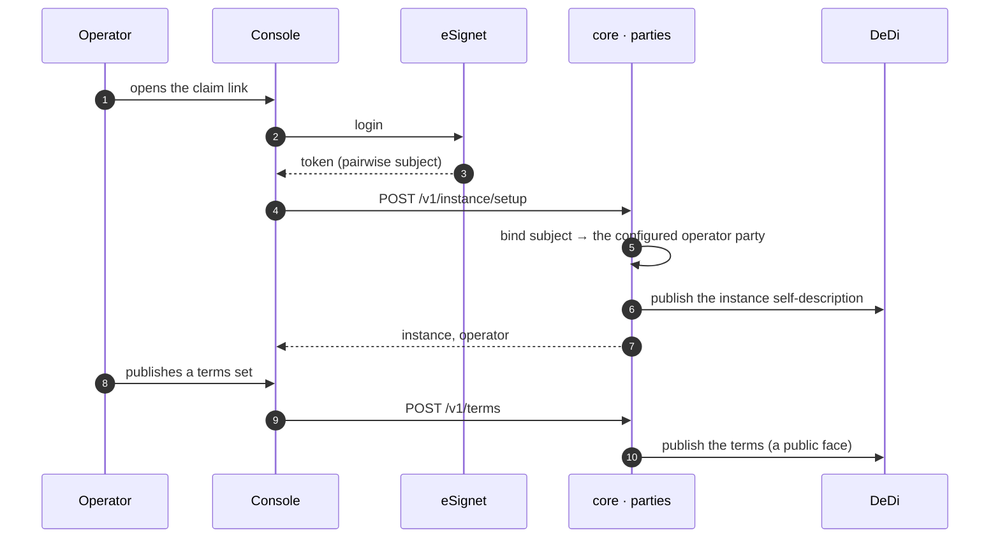

# Standing the instance up

**J2 · G-1.** A deployment starts with nobody in it. `tools/bootstrap-operator` prints a one-time claim link; whoever opens it and signs in becomes the instance operator, and the instance's self-description is published to the registry. Nothing can be admitted until the operator has published a terms set.

## What holds it

- The setup call is accepted only from the subject the deployment was configured with (`CREST_SETUP_SUBJECT_REF`, `CREST_SETUP_ISSUER`); a second setup is refused.
- The operator party id is deployment configuration (`CREST_OPERATOR_PARTY_ID`); the fixture world's is the organisation `…RGN`.
- Terms are versioned and public; a grant can never exceed the terms it cites (`wider_than_terms`).

## Recordings

- The operator claims and stands up (recording `J1-g1-operator-claims-and-stands-up.mp4`) (39 s)
- The operator publishes terms (recording `J1-g1-operator-publishes-terms.mp4`) (22 s)

Screens: g1_1–g1_6 in the journey traceability (`docs/journey-traceability.md` in the repository). Next: [ORGANISATION_ONBOARDING.md](ORGANISATION_ONBOARDING.md).
