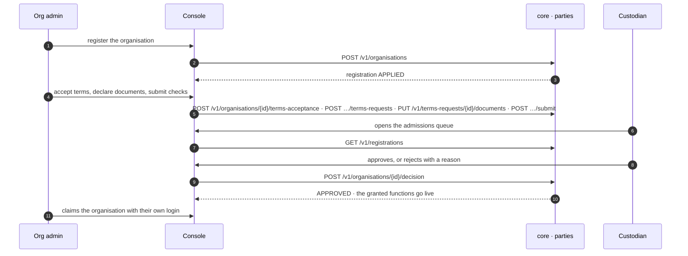

# An organisation joins

**J1 · G-2, G-4.** An organisation registers at the open door, accepts a published terms set, submits its checks, and claims its record with its own login. The registry custodian decides the admission; the operator can read the queue, but the decision is the custodian's act.

## What holds it

- Documents are declared, never uploaded: `{kind, ref, hash}` into the deployment's own custody. The registry never holds their bytes (finding #180).
- Check verdicts are append-only, owned by a party or a named policy, and only while the request is under review.
- Registration is listed and findable the moment it is made; only the terms request waits on a person.

## Recordings

- [The organisation registers and claims](../assets/clean-slate-watch/J1-g2-organisation-registers-and-claims.mp4) (41 s)
- [The operator admits the organisation](../assets/clean-slate-watch/J1-g4-operator-admits-the-organisation.mp4) (16 s)

Screens: g2_1–g2_12, g4_1–g4_3. Next: [PROJECT_SETUP.md](PROJECT_SETUP.md).

