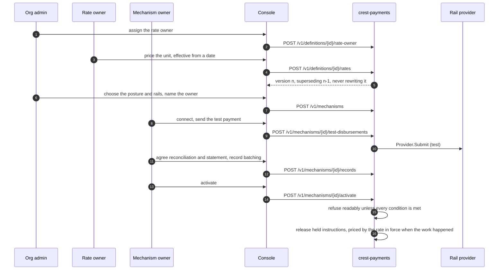

# Money is set up: a rate as terms, a mechanism under its owner

**J5 · F-1, F-2.** The organisation assigns a rate owner; only they may publish a rate, and a rate is versioned terms, never edited, effective from a date. The organisation stands a mechanism up naming its owner; the owner connects it, sends a test disbursement, agrees reconciliation and statements, records the batching choice, and activates. Until activation every obligation is held as `mechanism_not_live` with the owner's name on it.

## What holds it

- Only the assigned owner authors a rate (`not_rate_owner`); a rate is a linked record on the definition version with an `effectiveFrom`.
- A unit is priced by the version in force when its period started, never the latest, so publishing a new rate cannot reprice work already done.
- Activation before the acts is refused with the list of unmet conditions, each naming the act that satisfies it.

## Recordings

- The org assigns the rate owner (recording `J5-f1-org-assigns-the-rate-owner.mp4`) (23 s)
- The rate owner publishes the rate (recording `J5-f1-rate-owner-publishes-the-rate.mp4`) (29 s)
- The org stands up the mechanism (recording `J5-f2-org-stands-up-the-mechanism-under-its-owner.mp4`) (22 s)
- The owner connects, tests and activates (recording `J5-f2-mechanism-owner-connects-tests-and-activates.mp4`) (77 s)

Screens: f1_1–f1_5, f2_1–f2_10. Next: [ENROLMENT.md](ENROLMENT.md).
