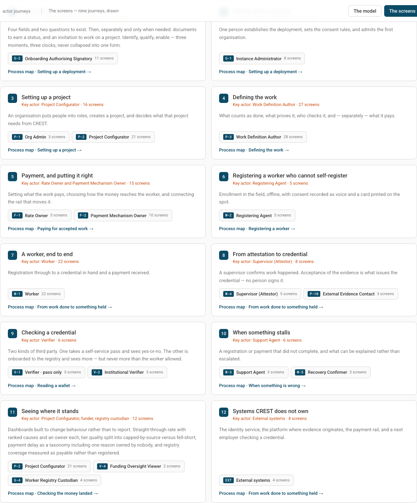
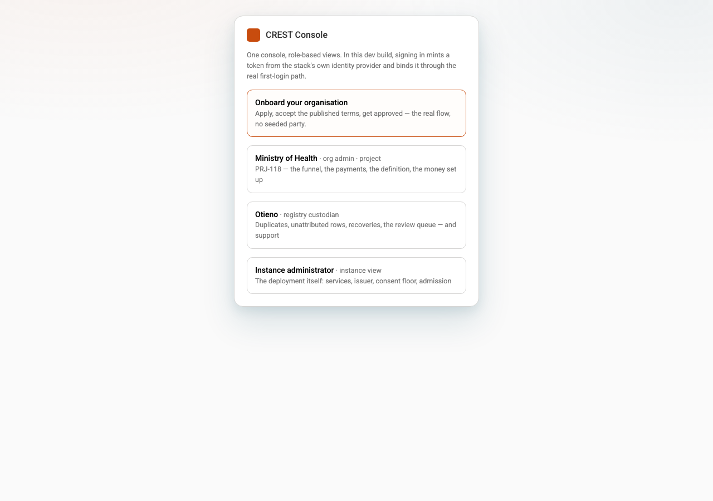
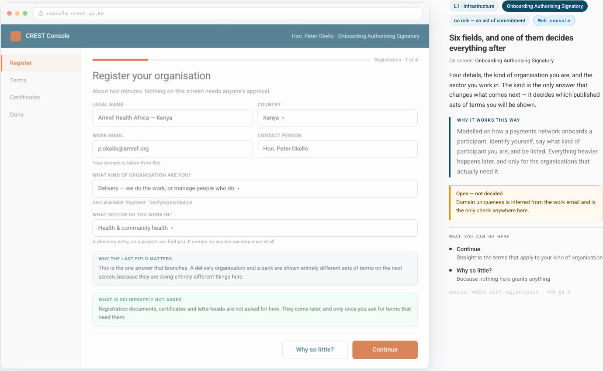
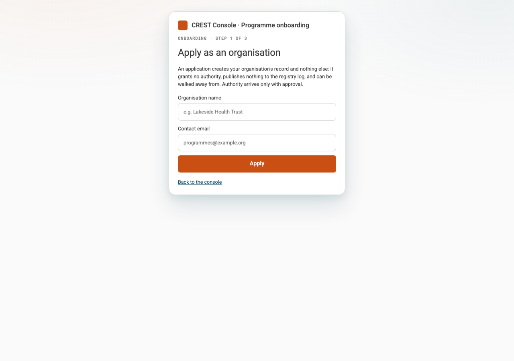
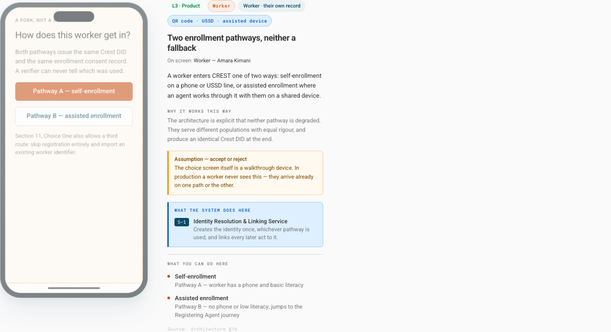
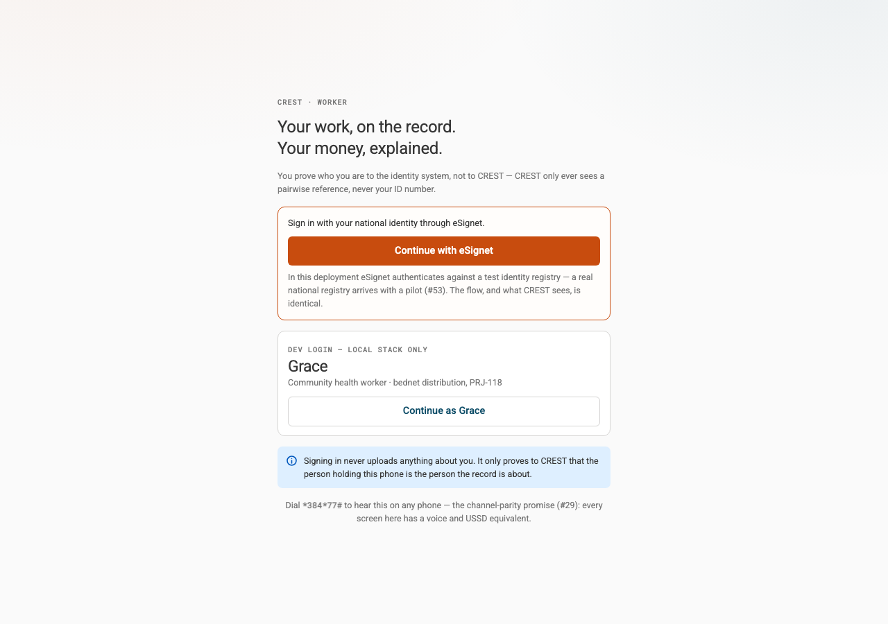

# CREST React Journey Gap Assessment

**Assessment date:** 2 September 2026  
**Reference:** `docs/reference/CREST — Actor Journeys_17Aug.html`  
**Implementation:** `frontend/apps/{console,field,verify,worker}`

> **Journey 4 update — 4 September 2026.** This assessment captured the
> pre-authoring baseline. P-3 has since been implemented as a server-backed
> draft → validate → submit → separate ratifier → atomic publish flow. The
> current screen-level source of truth is
> [`journey-traceability.md`](journey-traceability.md#p-3--work-definition-author-28-screens):
> 24 screens are implemented and four are deliberately compressed. The
> remaining gaps are real role invitations/grants on `p3_11`/`p3_20`, source
> owner notification on `p3_28`, and delivery/authority on `p3_pay`.

## Executive assessment

The React applications do not faithfully implement the Actor Journeys as end-to-end products.
They reuse much of the reference visual grammar and they expose several real backend operations,
but they compress or replace many of the decisions, actors, states, and handoffs that define the
journeys.

The reference contains:

- **12 end-to-end journeys**;
- **18 detailed role flows** (excluding role cards explicitly marked as stubs); and
- **143 detailed screens** across those flows.

The implementation contains four applications, but those applications are better understood as
**channels** than as four personas:

- `worker`: the worker channel;
- `field`: registering agent plus supervisor/assisted-confirmation work;
- `verify`: pass-only verifier, institutional verifier, and external evidence panel; and
- `console`: instance administration, organisation administration, project operations, definition
  viewing, payment viewing, registry custody, support, and funding oversight.

This distinction matters. The reference deliberately separates authors, approvers, operators,
reviewers, support staff, and payment owners. The React console places several of those functions
behind one coarse `org` persona. A matching colour palette or screen title therefore does not mean
the journey has been implemented.

## Rating method

Each journey or role flow is rated as:

- **Implemented:** the reference decisions and state transitions can be completed in the UI.
- **Mostly implemented:** the main path works, with bounded missing states or channels.
- **Partial:** some screens or real operations exist, but material decisions or handoffs are absent.
- **Read-only / illustrative:** the UI displays existing data or a labelled mock, but cannot perform
  the reference journey.
- **Semantically different:** the UI performs a real operation, but it is not the operation at that
  point in the reference lifecycle.
- **Missing:** no corresponding user flow exists.

An `Illustrative` or `Not backed yet` label is good product honesty, but it is still a gap when the
question is reference fidelity.

The review used four forms of proof:

1. the 12-journey launcher and all `.role-page[data-mode="detailed"]` / `.role-step` nodes in the
   reference HTML;
2. React routes, actions, API calls, and explicit caveats in source;
3. the existing Playwright acceptance tests and test-manifest claims; and
4. live screenshots from the local app door at `http://localhost:59110` at 1280x900, plus direct
   screenshots of the reference HTML.

`pnpm -C frontend typecheck` passed. This assessment is about journey completeness and fidelity,
not TypeScript correctness.

## Reference baseline

The source says there are twelve journeys. It also names the actor flows and screen counts that
compose each journey (`docs/reference/CREST — Actor Journeys_17Aug.html:867`).

Adding the detailed role-flow screen counts gives 143 screens. This does not mean a production app
must preserve every storyboard frame as a separate URL. It does mean it must preserve the decisions,
state transitions, responsibilities, and closure described by those frames. The React apps often do
not.

## Principal findings

### 1. Four applications are not four personas

The console defines only three persona choices: `org`, `custodian`, and `instance`
(`frontend/apps/console/src/state.tsx:10-32`). The `org` choice is labelled `org admin · project`, but
its navigation also exposes project reports, the definition wizard, payment setup, organisation
administration, and funder portfolio (`frontend/apps/console/src/App.tsx:14-31`).

That collapses at least these reference roles:

- Org Admin;
- Project Configurator;
- Work Definition Author;
- Work Definition Approver, which is not represented at all;
- Rate Owner;
- Payment Mechanism Owner;
- Project/Funding Reviewer; and
- some source-system and payment-administration responsibilities.

The reference makes author/approver separation explicit: an approver ratifies what an author drafted
and may never draft it. The React persona model cannot express that separation. The fixture also uses
the same organisation identity for the org and instance personas
(`frontend/apps/console/src/state.tsx:6-9,26-30`).

**Missing:** role-specific sessions, navigation, permissions, task queues, invitations, and author /
approver separation for every console action.

### 2. J1-J5 are viewers or summaries, not setup journeys

The implementation describes itself as a console reimplementation, but its own components identify
the missing write side:

- At the assessment date, definition authoring said adaptor mapping, extensions, and authoring
  writes were not built. That reader has since been replaced by the server-backed P-3 wizard in
  `frontend/apps/console/src/views/Define.tsx`; see the Journey 4 update above.
- At the assessment date, the 28-screen P-3 journey was reduced to ten selectable read-only
  sections. All 28 screens now have explicit routes and API evidence in the generated traceability
  ledger; 24 are implemented and four retain named delivery/authority gaps.
- Payment setup reads an existing linked rate; its payment rail is labelled illustrative/simulated
  and cannot connect a rail (`Admin.tsx:165-232`).
- Instance consent scripts cannot be edited and its admission queue is illustrative
  (`Admin.tsx:384-403`).
- Organisation invitations and terms are illustrative because no invitation service exists
  (`Admin.tsx:305-315`).

The onboarding comparison is especially clear. The reference begins with six fields whose
organisation kind and sector control later terms. The React flow asks for only an organisation name
and contact email, then moves directly to terms.

**Missing:** instance creation, consent-policy configuration, invitation and admission queues,
organisation qualification documents, role assignment, project creation, project configuration,
partner grants, finance-code linking, support ownership, work-definition authoring, source/adaptor
configuration, ratification, rate authoring/publishing, rail configuration/testing, reconciliation
contract setup, and activation gates.

### 3. J8 is implemented at the wrong lifecycle boundary

The W-4 reference flow has a supervisor confirm or correct work in the delivery/source platform.
That platform then closes a roster and sends evidence to CREST. The reference explicitly says the
worklist belongs to the delivery platform and that the confirmation reaches CREST as ingested
evidence (`docs/reference/CREST — Actor Journeys_17Aug.html:3596-3710`).

The React `ToConfirm` screen instead reads CREST confirmation windows from
`GET /v1/unreached` (`frontend/apps/field/src/screens/Attest.tsx:23-35`). Its confirm action exits a
worker's confirmation window with `route: "assisted"`
(`frontend/apps/field/src/state.tsx:136-149`). Its “different figure” action raises a worker dispute
on the worker's behalf (`state.tsx:152-163`).

Those are valid assisted-worker actions, but they are not source attestation. Labelling them J8/W-4
makes a later event look like the upstream evidence decision.

The external evidence contact half is also display-only: the panel says no scoped-link endpoint
exists and no file can be returned from it (`frontend/apps/verify/src/screens/Panel.tsx:53-57`).

**Missing:** a real source-platform attestation surface, corrected source record, roster close,
provenance-preserving ingestion handoff, external scoped request, template download, evidence-file
upload, receipt, and evidence-state result.

### 4. Worker enrollment does not preserve the two equal pathways

The first W-1 screen presents self-enrollment and assisted enrollment as equal paths. Self-enrollment
then covers phone/OTP, optional national ID, a no-document confidence route, consent, the CREST ID,
and recovery contacts.

The React worker starts with national-identity sign-in through eSignet
(`frontend/apps/worker/src/screens/Login.tsx:31-40`). An authenticated stranger then has to provide a
name and a required phone before the record is created (`frontend/apps/worker/src/screens/Auth.tsx:68-115`).
There is no self-service no-document route, enrollment-consent step before record creation, recovery
contact nomination, or CREST-card issuance.

The assisted registration path is stronger: it has an offline queue, phone-or-roster enrollment,
duplicate hold, consent script, and a registered result. Important gaps remain:

- the “voice recording” currently posts a text sentence with `audio/ogg` content type rather than
  capturing audio (`frontend/apps/field/src/state.tsx:111-130`);
- identity assertion is explicitly illustrative (`frontend/apps/field/src/screens/Enrol.tsx:164-167`);
- card printing is illustrative and deferred until a first credential
  (`Enrol.tsx:257-263`), unlike the reference's on-the-spot enrollment card; and
- the offline queue stores registrations but does not persist the consent artifact as part of the
  same offline transaction.

**Missing:** faithful self-enrollment, equal pathway selection/handoff, phone OTP, optional ID,
no-document confidence check, enrollment consent, recovery nominations, usable physical/offline
credential, and channel-parity implementations rather than explanatory copy.

### 5. Material worker wallet and consent states are illustrative

The worker app has useful real functionality: work-definition reading, confirmation, dispute,
credentials, payments with held reasons, consent withdrawal, and a verification trail. The following
reference behaviors are not implemented:

- declined work (`frontend/apps/worker/src/screens/Work.tsx:242-255`);
- deferred qualification (`frontend/apps/worker/src/screens/Wallet.tsx:196-210`);
- time-boxed, revocable, credential-scoped share links (`Wallet.tsx:215-228`);
- per-share disclosure selection and consent;
- explicit withheld-versus-absent fields in the shared artifact;
- a QR/PixelPass or equivalent offline presentation; the current show screen renders JSON
  (`Wallet.tsx:183-189`);
- recovery-contact reads and edits (`frontend/apps/worker/src/screens/Profile.tsx:190-207`); and
- notifications: the app states that they are switched off and workers must open the app to learn
  about windows or held payments (`Profile.tsx:175-185`).

These gaps directly affect the reference promises that a worker can prove work offline in under a
minute, control what is shared, and be told when something is returned or stalled.

### 6. J10 support is partial and W-5 is missing

The console provides a useful synthesized support queue, worker lookup, payment trace, and recovery
administration. It explicitly has no case-management service
(`frontend/apps/console/src/views/Custodian.tsx:368-410`).

The Recovery Confirmer's three-screen SMS journey is absent. Recovery is handled entirely from the
custodian console, while the worker's own app cannot display nominated contacts. There is no
confirmer-facing request, approve/refuse action, two-of-three progress view, or worker-visible path
when two confirmations never arrive.

**Missing:** W-5 channel, confirmer authentication/link scope, confirm/refuse action, quorum progress,
timeout/refusal resolution, and worker/support closure messages.

### 7. J11 dashboards do not implement the behavior-changing metrics

The project status, payments, trace, and source screens read real queues. However:

- straight-through rate, tier mix, and time-to-say metric contracts are explicitly unbuilt
  (`frontend/apps/console/src/views/Project.tsx:78-82`);
- funder allocated-versus-paid is illustrative because there is no funding ledger
  (`frontend/apps/console/src/views/Admin.tsx:429-450`);
- funder trail-down is reduced to opening the generic project status view;
- registry coverage-by-place is absent;
- registry quality as a record-by-record worklist is absent;
- capped-by-source versus fell-short tier quality is absent; and
- registry reuse/return-on-shared-registry is absent.

The duplicates queue is the closest G-4 implementation, including the no-auto-merge metric and
worker-confirmation requirement (`frontend/apps/console/src/views/Custodian.tsx:148-179`).

**Missing:** metric contracts, ranked causes with owners, actionable drill-downs, geography coverage,
quality worklists, reuse metrics, funding ledger, allocation-to-paid portfolio, and funder trace to
place/service/day.

### 8. J9 verification is closest, but not complete

The verify app implements real signature verification, a result chain, institutional checks, bounded
batch verification, and person-chain resolution. Its own caveats identify the remaining gaps:

- verifier-pass issuance has no endpoint (`frontend/apps/verify/src/screens/V1.tsx:59-68`);
- “scan” is a JSON textarea or a fixture lookup, not camera/QR/offline scanning (`V1.tsx:99-135`);
- the institutional accreditation ceiling cannot be read (`frontend/apps/verify/src/screens/V2.tsx:45-48`);
- selective disclosure does not exist, so the screen can show only presence/absence, not worker
  refusal (`V2.tsx:59-63,187-197`); and
- the external evidence-contact journey is informational only.

**Missing:** pass issuance, portable pass identity, actual scan/offline verification path,
accreditation fact, worker-approved presentation, selective disclosure, refusal representation, and
external attestation return.

### 9. Visual tokens are faithful; screen composition is not

`frontend/packages/ui/src/styles.css` copies the palette, type scale, console app bar, sidebar,
chips, sidecars, and table grammar from the reference. This is real fidelity.

The composition changed materially:

- the worker app is explicitly rebuilt as a desktop console with a sidebar
  (`frontend/apps/worker/src/App.tsx:1-3,75-99`);
- the field app also uses the generic desktop `ConsoleShell`;
- reference phone screens become wide desktop panes;
- reference step progress, decision framing, and narrative closure are often compressed into one
  page; and
- a generic `panel-shell` is reused for onboarding, login, and external panels even when the
  reference uses a full console or phone flow.

The responsive worker bottom navigation is useful, but responsive fit is not the same as preserving
the reference information architecture.

### 10. Existing tests cannot prove the “1:1” claims

The test manifest says the worker, verify, field, and console applications reimplement their journeys
“1:1” (`docs/test-manifest.md:342-345`). That conflicts with both the source caveats above and the
older demo design note, which says J1, J2, J4, J5 wizards, and funder oversight are deliberately
undrawn (`docs/DEMO.md:80-84`).

The Playwright helper defines an alive route as:

- no page exception;
- no `.errbar`; and
- body text longer than 80 characters
  (`tests/e2e-apps/apps.spec.js:28-32`).

The suite walks a list of React routes, but it does not compare them with the 143 reference screens,
assert role separation, exercise the missing decisions, check the source/CREST lifecycle boundary,
or perform screenshot comparisons. It proves route health, not journey fidelity.

**Missing:** a traceability manifest and acceptance tests tied to reference screen IDs, actor,
decision, expected state transition, API evidence, and terminal closure.

## Twelve-journey coverage matrix

| Journey | Reference composition | Current implementation | Rating | Material missing work |
|---|---|---|---|---|
| J1 Onboarding an organisation | G-2, 11 detailed screens; 13-screen end-to-end journey | Three public onboarding routes plus an illustrative organisation card | **Partial** | Four reference details plus kind/sector branching, qualification, documents, invitation, enablement, immutable terms, certificate checks |
| J2 Setting up the instance | G-1, 8 detailed screens; 9-screen journey | One read-only instance/health page, illustrative admission queue | **Read-only / illustrative** | Stand-up, instance identity binding, consent configuration, first invitation, pending-review queue, review and approval |
| J3 Setting up a project | P-1 (3) + P-2 (21), 16-screen journey path | Org/profile reader and operational project dashboards | **Partial; setup missing** | Assign people to roles, create project, five independent choices, worker sources, definition origin, evidence intake, validation posture, payment posture, owners, partner grants, activation |
| J4 Defining the work | P-3, 28 detailed screens | 28 mapped routes over server-held drafts, immutable versions, linked records and a separate ratifier | **Mostly implemented (24 implemented, 4 compressed)** | Real role invitation/grant delivery (`p3_11`, `p3_20`), source-owner notification on version change (`p3_28`), and rate-owner notification/assignment after handoff (`p3_pay`) |
| J5 Payment and putting it right | F-1 (5) + F-2 (10) | Existing rate reader and illustrative rail | **Read-only / illustrative** | Assign owner, author/publish rate, worker terms, mechanism boundary, rails, connection, real payment test, reconciliation file, statement, batching, activation/qualification gates |
| J6 Registering a worker who cannot self-register | W-2, 5 screens | Offline queue, registration, consent script, duplicate hold, completion | **Mostly implemented** | Real audio artifact, identity assertion, offline consent transaction, card printing, complete no-phone notification/handoff |
| J7 A worker end to end | W-1, 22 screens | Real work/payment/wallet operations plus several illustrative screens | **Partial** | Equal enrollment pathways, no-document self path, enrollment consent, recovery contacts, offline presentation, declined work, deferred qualification, selective sharing, per-share consent, notifications |
| J8 From attestation to credential | W-4 (5) + P-10 (3) | Assisted worker confirmation/dispute plus static external panel | **Semantically different / partial** | Source-platform attestation/correction, roster close boundary, external scoped request and evidence return, receipt and resulting tier/state |
| J9 Checking a credential | V-1 (3) + V-2 (3) | Real verification and batch/person checks | **Mostly implemented** | Pass issuance, actual scan/offline UX, readable accreditation, worker-approved selective disclosure and explicit refusal |
| J10 When something stalls | W-3 (3) + W-5 (3) | Synthesized support queue, lookup, trace, custodian recovery admin | **Partial** | Recovery Confirmer journey, quorum communication, refusal/timeout path, case ownership/closure and notifications |
| J11 Seeing where it stands | P-2 monitoring + V-4 (2) + G-4 (4), 12-screen journey | Thin project metrics, payments, sources, one-row portfolio, duplicates | **Partial** | STP/tier/time metrics, ranked causes, coverage/quality/reuse, funding allocation, portfolio drilldown and exportable reports |
| J12 Systems CREST does not own | EXT, 4 screens | No equivalent walkthrough | **Missing, but external by design** | Integration handoff demonstrations for identity, source evidence, payment rail, and next-employer verification; these need not be CREST-owned apps |

## Detailed role-flow inventory

| Role flow | Reference screens | Assessment | Missing or different |
|---|---:|---|---|
| G-1 Instance Administrator | 8 | Read-only / illustrative | Setup, consent edit, invite, review, approval |
| G-2 Onboarding Authorising Signatory | 11 | Partial | Six-field identity, qualification, documents, invitations, enablement |
| G-4 Worker Registry Custodian | 4 | Partial | Coverage, quality worklist, reuse; duplicates substantially present |
| P-1 Org Admin | 3 | Missing as an action flow | Assign roles and create/handover project |
| P-2 Project Configurator | 21 | Monitoring subset only | Project composition and activation screens; several J11 metrics |
| P-3 Work Definition Author | 28 | Mostly implemented: 24 implemented, 4 compressed | Invitations/grants, source-owner notification, and handoff delivery/authority |
| P-10 External Evidence Contact | 3 | Illustrative | Scoped request, file return, receipt/result |
| F-1 Rate Owner | 5 | Read-only summary | Assignment, rate editing, publication, handoff |
| F-2 Payment Mechanism Owner | 10 | Illustrative | Complete mechanism/rail configuration and activation |
| W-1 Worker | 22 | Partial | Enrollment, recovery, offline proof, sharing, notifications, illustrative states |
| W-2 Registering Agent | 5 | Mostly implemented | Real voice/card/identity and fully offline consent |
| W-3 Support Agent | 3 | Mostly implemented | Real case model, closure and notifications |
| W-4 Supervisor (Attestor) | 5 | Semantically different | Source-platform attestation is replaced by assisted worker confirmation |
| W-5 Recovery Confirmer | 3 | Missing | Entire confirmer-facing journey |
| V-1 Verifier | 3 | Partial | Pass issuance and actual scanning/offline check UX |
| V-2 Institutional Verifier | 3 | Partial | Accreditation read and selective disclosure |
| V-4 Funding Oversight Viewer | 2 | Partial | Allocation and trace-down to place/service/day |
| EXT External systems | 4 | Missing / out of product boundary | Explicit handoff walkthroughs, integration examples |

Role cards that the reference itself marks as stubs were not counted as missing detailed journeys.
They remain future persona scope, including Data Protection / Consent Officer, Accrediting Authority,
Work Definition Approver, Evidence Validator, Fraud & Anomaly Reviewer, Grievance Manager, Project
Viewer, Source-System Administrator, Payment Approver, Payment Executor, Bank/FSP Relationship Owner,
Reconciliation Reviewer, Auditor, and platform/registry/vocabulary roles.

## Missing-work register by application

### Console

1. Replace coarse personas with role- and grant-derived navigation and task queues.
2. Implement G-1 instance setup and admission decisions.
3. Complete G-2 identify/qualify/enable onboarding.
4. Implement P-1 role assignment and project creation.
5. Implement P-2 project composition, staffing, grants, finance/support setup, and activation.
6. Close P-3's remaining delivery gaps: turn descriptive role holders and payment handoffs into invitations/assignments, and notify source owners when a new version requires re-test.
7. Implement F-1 rate authoring/publication and F-2 mechanism/rail configuration.
8. Separate author, approver, operator, and reviewer sessions and permissions.
9. Add the missing J11 metric contracts and dashboard drilldowns.
10. Add V-4 funding ledger/portfolio trace or explicitly remove it from implemented scope.

### Worker

1. Implement complete self-enrollment and assisted-enrollment handoff.
2. Capture enrollment consent before activating the worker record.
3. Implement no-document/no-phone paths without requiring eSignet plus phone.
4. Add recovery-contact nomination and maintenance.
5. Add real offline credential presentation, not raw JSON.
6. Implement declined work and deferred qualification states.
7. Implement scoped, revocable share links and per-share consent.
8. Implement selective disclosure and explicit refusal states.
9. Add notification/channel parity or clearly scope the product away from the reference promise.

### Field

1. Persist the full enrollment and consent artifact offline and sync atomically/idempotently.
2. Capture real audio or another verifiable assisted-consent artifact.
3. Support the intended identity-assertion path.
4. Produce the physical/offline worker artifact promised by the journey.
5. Separate Registering Agent from Supervisor (Attestor) identity and permissions.
6. Replace the mislabeled J8 flow with source-platform attestation/correction and ingestion handoff.
7. Add the W-5 Recovery Confirmer channel, likely as scoped SMS/link rather than a console role.

### Verify / external panel

1. Issue and resolve verifier passes.
2. Implement camera/QR/PixelPass and genuinely offline verification.
3. Read institutional accreditation and enforce/display its scope.
4. Accept worker-approved presentations with selective disclosure.
5. Distinguish withheld, absent, and not-applicable fields.
6. Implement scoped external evidence requests and file return.

### Cross-cutting proof

1. Create a machine-readable map from all reference screen IDs to React route/state/action.
2. Mark each screen `implemented`, `compressed`, `illustrative`, `semantically different`, or
   `missing`.
3. Replace blanket `1:1` claims with measured coverage.
4. Add actor/permission assertions, not only route-alive assertions.
5. Add journey tests that prove decisions, API state transitions, handoffs, and terminal closure.
6. Add representative screenshot comparisons at desktop and mobile sizes.
7. Keep backend-blocked work visible, but do not count an explanatory panel as an implemented journey.

## Recommended sequence

### P0: Make coverage truthful and testable

- Add the reference traceability manifest and remove unsupported `1:1` claims.
- Define which of the 12 journeys are committed product scope versus demonstrative/external scope.
- Split “screen exists,” “screen is interactive,” and “journey completes” in the test manifest.

### P1: Restore actor and approval boundaries

- Implement role-derived console sessions/navigation.
- Separate author/approver and reviewer/operator responsibilities.
- Build J1-J3 before expanding dashboards; otherwise configuration remains fixture-only.

### P2: Build the two core creation paths

- Complete P-3's remaining invitation, authority, and source-owner notification edges.
- Complete F-1/F-2 payment setup and activation.
- Correct J8 so evidence is attested where it originates and only then ingested by CREST.

### P3: Close worker guarantees

- Complete enrollment parity, recovery contacts, offline credential presentation, scoped sharing,
  and notifications.
- Finish W-5 and the external evidence-contact return path.

### P4: Finish oversight and verification fidelity

- Implement the J11 metric/funding contracts.
- Add verifier passes, actual scanning/offline verification, accreditation reads, and selective
  disclosure.

## Conclusion

The current React layer is a useful live-service demonstration, especially for payment explanation,
duplicate holds, assisted registration, credential verification, and worker confirm/dispute. It is
not yet a faithful implementation of the console and actor journeys.

The main correction is conceptual: measure the product against actors, decisions, and state
transitions, not against route count or visual tokens. Once the 143 reference frames are represented
in a traceability manifest, the missing work becomes an executable backlog rather than a disputed
claim about whether a page “looks like” the design.
